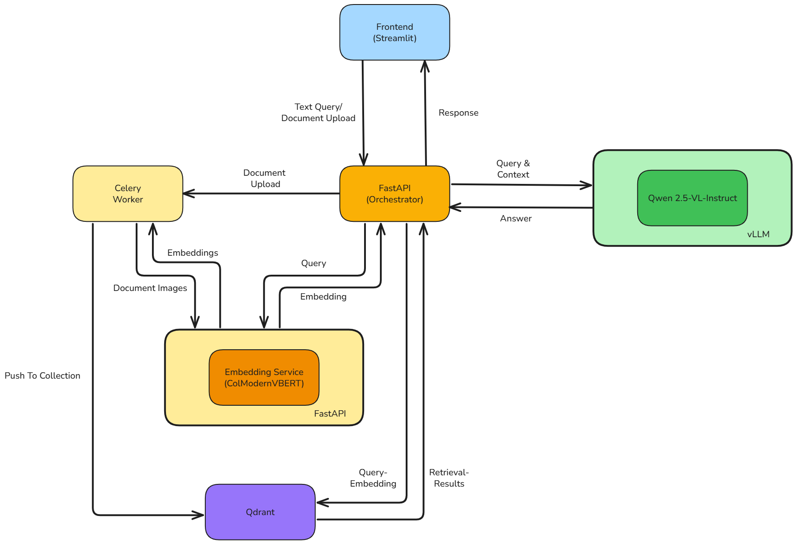

# Simple Vision RAG

## Introduction

This RAG implements simple visual document retrieval using `Qdrant` as vector database. `ModernVBERT/colmodernvbert` is used as the embedding model and `Qwen/Qwen2.5-VL-7B-Instruct` as the vision LM.

## Architecture

